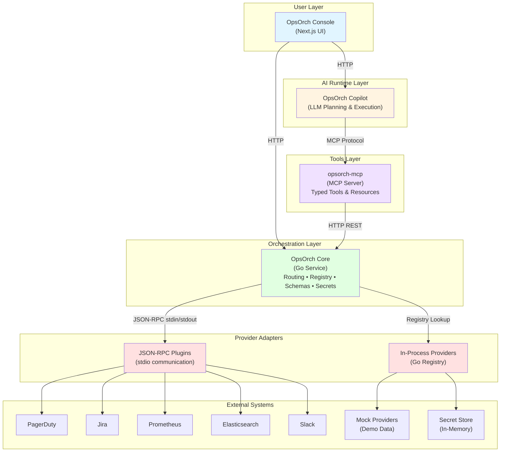

# OpsOrch

OpsOrch is an open, modular incident-operations platform that unifies incidents, logs, metrics, tickets, messaging, and services behind one orchestration layer. The project is split into focused repos so teams can mix and match pieces—from the Go core to MCP tools, Copilot runtime, console UI, and provider adapters—while keeping proprietary data in existing systems. Learn more at [opsorch.com](https://www.opsorch.com/).

## Why OpsOrch
- **Single API surface** for operational data across vendors without replicating records.
- **Adapter model** keeps provider logic decoupled, supporting in-process and plugin execution paths.
- **AI-native workflows**: the MCP server exposes typed tools and the Copilot runtime plans/tool-calls answers with citations.
- **Operator console**: a Next.js UI to browse incidents/logs/metrics/tickets/services and collaborate with Copilot outputs.
- **Security-first**: secrets stay encrypted, and Core remains stateless aside from integration metadata and optional audit logs.

## Repository Map

### Core Infrastructure
| Repo | Description |
| --- | --- |
| [`opsorch-core`](https://github.com/OpsOrch/opsorch-core) | Stateless Go orchestration service providing unified REST APIs, capability registry, schema boundaries, secret management, and plugin loader. Zero operational data storage. |
| [`opsorch-mcp`](https://github.com/OpsOrch/opsorch-mcp) | TypeScript MCP server exposing Core APIs as typed tools/resources for LLM agents (Claude, ChatGPT, etc). Supports both stdio and HTTP transports. |
| _`opsorch-copilot` (private)_ | AI runtime with planning loops that execute MCP tool calls via LLMs. Supports mock and OpenAI-compatible backends. |
| _`opsorch-console` (private)_ | Next.js operator UI for browsing incidents/logs/metrics/tickets, executing searches, and collaborating with AI responses. |

### Provider Adapters
| Repo | Capability | Description |
| --- | --- | --- |
| [`opsorch-pagerduty-adapter`](https://github.com/OpsOrch/opsorch-pagerduty-adapter) | Incident, Service | PagerDuty integration for incident management and service discovery with timeline support. |
| [`opsorch-jira-adapter`](https://github.com/OpsOrch/opsorch-jira-adapter) | Ticket | Jira integration for ticket CRUD operations with support for labels, components, and custom fields. |
| [`opsorch-prometheus-adapter`](https://github.com/OpsOrch/opsorch-prometheus-adapter) | Metric | Prometheus integration for metric querying and discovery with PromQL support. |
| [`opsorch-elastic-adapter`](https://github.com/OpsOrch/opsorch-elastic-adapter) | Log | Elasticsearch integration for log querying with full-text search and structured filtering. |
| [`opsorch-slack-adapter`](https://github.com/OpsOrch/opsorch-slack-adapter) | Messaging | Slack integration for sending rich messages to channels using Block Kit with Markdown support. |
| [`opsorch-mock-adapters`](https://github.com/OpsOrch/opsorch-mock-adapters) | All | Demo adapters returning seeded data for all capabilities. Ideal for development and demos. |
| [`opsorch-adapter`](https://github.com/OpsOrch/opsorch-adapter) | Template | Starter template for building new provider adapters with examples and best practices. |

## Architecture



### Key Components

- **Console**: Operator-focused UI for browsing incidents, logs, metrics, services, tickets, and AI chat
- **Copilot**: AI runtime that uses LLMs to plan and execute MCP tool calls for operational queries
- **MCP Server**: Exposes Core APIs as typed MCP tools/resources for agent runtimes
- **Core**: Stateless Go service providing unified APIs, routing, schema boundaries, and secret management
- **Adapters**: Provider-specific implementations loaded in-process (via registry) or out-of-process (via JSON-RPC plugins)

### Design Principles

- **Core contracts** live under `opsorch-core/schema` and `opsorch-core/api`
- **Registry selection** is driven by env vars: `OPSORCH_<CAP>_PROVIDER` or `OPSORCH_<CAP>_PLUGIN` with `OPSORCH_<CAP>_CONFIG` JSON
- **Plugin RPC** uses JSON over stdin/stdout, keeping traffic on-box. `opsorch-mock-adapters` ship ready-made binaries under `bin/`
- **Secrets** are encrypted at rest and only decrypted when invoking providers; never logged or returned
- **No data replication**: Core holds only encrypted integration configs and optional audit logs; operational data stays in source systems

For deeper context, see `OPSORCH_MASTER.md` (in repo root) and `opsorch-architecture.drawio`.

## Run the Stack Locally
1. **Core with mock providers**
   ```bash
   cd opsorch-core
   OPSORCH_INCIDENT_PLUGIN=./plugins/incidentmock \
   OPSORCH_LOG_PLUGIN=./plugins/logmock \
   OPSORCH_SECRET_PLUGIN=./plugins/secretmock \
   go run ./cmd/opsorch
   ```
   (Optional) Build extra mock plugins via `make plugin` inside `opsorch-mock-adapters` and point env vars at `../opsorch-mock-adapters/bin/*`.

2. **MCP tools layer**
   ```bash
   cd ../opsorch-mcp
   npm install
   OPSORCH_CORE_URL=http://localhost:8080 OPSORCH_CORE_TOKEN=demo npm run dev
   ```

3. **Copilot runtime**
   > Copilot runs from the private `opsorch-copilot` repo; the same env vars apply once you have access.

4. **Console UI**
   > Console lives in the private `opsorch-console` repo; follow the same steps after cloning.

Health checks:
```bash
curl http://localhost:8080/health
curl -s http://localhost:7070/mcp \
  -H 'Content-Type: application/json' -H 'Accept: application/json, text/event-stream' \
  -d '{"jsonrpc":"2.0","id":1,"method":"tools/list"}'
```

## Build New Adapters

### Quick Start
1. **Fork the template**: Copy [`opsorch-adapter`](https://github.com/OpsOrch/opsorch-adapter) as `opsorch-<provider>-adapter`
2. **Choose capabilities**: Implement interfaces you need:
   - `incident.Provider` - Create/query/update incidents, manage timelines
   - `log.Provider` - Query logs with structured expressions
   - `metric.Provider` - Query metrics, discover available metrics
   - `ticket.Provider` - CRUD operations for tickets
   - `service.Provider` - Service discovery and metadata
   - `messaging.Provider` - Send messages to channels/users
   - `secret.Provider` - Encrypted secret storage
3. **Register provider**: Export `New(config map[string]any)` and call `<capability>.RegisterProvider("<name>", New)`
4. **Normalize data**: Map provider responses to OpsOrch schemas; use `metadata` for provider-specific fields
5. **Test thoroughly**: Add unit tests and integration tests (see existing adapters for examples)
6. **Deploy**: Build as plugin binary (`make plugin`) or import directly into custom Core build

### Examples
- **PagerDuty**: Incident + Service providers with QueryScope support
- **Jira**: Ticket provider with custom fields and JQL filtering  
- **Prometheus**: Metric provider with PromQL and structured queries
- **Elasticsearch**: Log provider with full-text search and structured filtering

See individual adapter READMEs for detailed implementation patterns.

## Build Custom Docker Images

Each adapter repository publishes pre-built plugin binaries as GitHub release assets for multiple platforms (linux-amd64, linux-arm64, darwin-amd64, darwin-arm64). You can compose custom Docker images by downloading specific adapter versions without building from source.

### Quick Example

Create a custom OpsOrch image with Jira, PagerDuty, and Slack adapters:

```dockerfile
FROM ghcr.io/opsorch/opsorch-core:latest
WORKDIR /opt/opsorch

# Download specific adapter versions
ADD https://github.com/opsorch/opsorch-jira-adapter/releases/download/v0.2.1/ticketplugin-linux-amd64 ./plugins/ticketplugin
ADD https://github.com/opsorch/opsorch-pagerduty-adapter/releases/download/v0.1.5/incidentplugin-linux-amd64 ./plugins/incidentplugin
ADD https://github.com/opsorch/opsorch-slack-adapter/releases/download/v0.3.0/messagingplugin-linux-amd64 ./plugins/messagingplugin

RUN chmod +x ./plugins/*

ENV OPSORCH_TICKET_PLUGIN=/opt/opsorch/plugins/ticketplugin \
    OPSORCH_INCIDENT_PLUGIN=/opt/opsorch/plugins/incidentplugin \
    OPSORCH_MESSAGING_PLUGIN=/opt/opsorch/plugins/messagingplugin \
    OPSORCH_BEARER_TOKEN=demo
```

Build and run:
```bash
docker build -t my-opsorch:latest .
docker run --rm -p 8080:8080 \
  -e OPSORCH_TICKET_CONFIG='{"apiToken":"...","projectKey":"PROJ"}' \
  -e OPSORCH_INCIDENT_CONFIG='{"apiToken":"...","serviceID":"..."}' \
  -e OPSORCH_MESSAGING_CONFIG='{"token":"xoxb-..."}' \
  my-opsorch:latest
```

### Available Adapters

| Adapter | Capability | Plugin Name | Latest Release |
|---------|------------|-------------|----------------|
| [opsorch-jira-adapter](https://github.com/opsorch/opsorch-jira-adapter) | Ticket | `ticketplugin` | [Releases](https://github.com/opsorch/opsorch-jira-adapter/releases) |
| [opsorch-pagerduty-adapter](https://github.com/opsorch/opsorch-pagerduty-adapter) | Incident, Service | `incidentplugin`, `serviceplugin` | [Releases](https://github.com/opsorch/opsorch-pagerduty-adapter/releases) |
| [opsorch-prometheus-adapter](https://github.com/opsorch/opsorch-prometheus-adapter) | Metric | `metricplugin` | [Releases](https://github.com/opsorch/opsorch-prometheus-adapter/releases) |
| [opsorch-slack-adapter](https://github.com/opsorch/opsorch-slack-adapter) | Messaging | `messagingplugin` | [Releases](https://github.com/opsorch/opsorch-slack-adapter/releases) |
| [opsorch-elastic-adapter](https://github.com/opsorch/opsorch-elastic-adapter) | Log | `logplugin` | [Releases](https://github.com/opsorch/opsorch-elastic-adapter/releases) |
| [opsorch-mock-adapters](https://github.com/opsorch/opsorch-mock-adapters) | All (Demo) | `incidentplugin`, `logplugin`, etc. | [Docker Image](https://github.com/opsorch/opsorch-mock-adapters/pkgs/container/opsorch-mock-adapters) |

### Advanced Patterns

**Multi-arch support:**
```dockerfile
ARG TARGETARCH
FROM ghcr.io/opsorch/opsorch-core:latest
WORKDIR /opt/opsorch

ADD https://github.com/opsorch/opsorch-jira-adapter/releases/download/v0.2.1/ticketplugin-linux-${TARGETARCH} ./plugins/ticketplugin
RUN chmod +x ./plugins/*
```

**Version pinning with ARGs:**
```dockerfile
ARG JIRA_VERSION=v0.2.1
ARG PAGERDUTY_VERSION=v0.1.5

FROM ghcr.io/opsorch/opsorch-core:latest
WORKDIR /opt/opsorch

ADD https://github.com/opsorch/opsorch-jira-adapter/releases/download/${JIRA_VERSION}/ticketplugin-linux-amd64 ./plugins/ticketplugin
ADD https://github.com/opsorch/opsorch-pagerduty-adapter/releases/download/${PAGERDUTY_VERSION}/incidentplugin-linux-amd64 ./plugins/incidentplugin
RUN chmod +x ./plugins/*
```

**Using the demo image:**
```bash
# opsorch-mock-adapters publishes a complete demo image with all mock plugins
docker run --rm -p 8080:8080 ghcr.io/opsorch/opsorch-mock-adapters:latest
```

## Safety & Operations
- Always pass `service`/`team`/`environment` scope fields to narrow expensive queries.
- Gate high-risk mutations (paging, ticket creation, severity bumps) behind approvals in Copilot or Console.
- Secrets are decrypted only when invoking providers; never log or return them.
- Use audit logs (`opsorch-core/api/audit_log*.go`) to track mutations if required.

## Contributing & Support
- Issues/PRs welcome across repos; follow `opsorch-core/CONTRIBUTING.md` for coding standards.
- Discuss architectures via `OPSORCH_MASTER.md` or the draw.io diagram.
- Need another adapter? File an issue in this meta repo or the relevant service repo.
