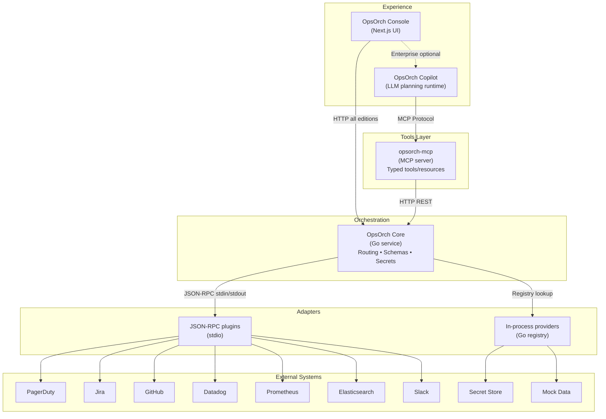

# OpsOrch

OpsOrch is an open, modular incident-operations platform that keeps operational data (incidents, logs, metrics, tickets, messaging, services, secrets) in the systems you already run and orchestrates them through a single API + AI workflow. Every repo in this org focuses on one layer of that stack so you can import just the pieces you need.

## Platform at a Glance

### Runtime + Experience Repos
| Repo | What it does | Highlights |
| --- | --- | --- |
| [`opsorch-core`](https://github.com/OpsOrch/opsorch-core) | Stateless Go orchestration service | REST APIs for every capability, registry + schema boundaries, secret backends, JSON-RPC plugin loader |
| [`opsorch-mcp`](https://github.com/OpsOrch/opsorch-mcp) | MCP server that wraps Core as typed tools/resources | HTTP + stdio transports, resources for docs, auth via bearer tokens, built with TypeScript |
| _`opsorch-copilot` (private)_ | AI runtime that plans + executes MCP tool calls | Capability-aware handler registry, multi-step planning, OpenAI/Mock backends, HTTP chat API |
| [`opsorch-console`](https://github.com/OpsOrch/opsorch-console) | Open-source Next.js operator UI | Incidents/logs/metrics/tickets/services views, alert surface, Copilot chat, OSS + Enterprise editions |
| _`opsorch-com` (private)_ | Marketing/docs site | Next.js 14 app powering opsorch.com with docs + launch content |

### Adapter + Integration Repos
| Repo | Capabilities | Notes |
| --- | --- | --- |
| [`opsorch-adapter`](https://github.com/OpsOrch/opsorch-adapter) | Template | Starter repo showing provider + plugin patterns |
| [`opsorch-mock-adapters`](https://github.com/OpsOrch/opsorch-mock-adapters) | All (demo) | Ships seeded data + demo binaries used in Docker examples |
| [`opsorch-github-adapter`](https://github.com/OpsOrch/opsorch-github-adapter) | Ticket, Deployment | GitHub Issues + Actions workflow runs with comprehensive filtering |
| [`opsorch-datadog-adapter`](https://github.com/OpsOrch/opsorch-datadog-adapter) | Metric, Log, Alert, Incident, Service | Uses official Datadog Go SDKs |
| [`opsorch-pagerduty-adapter`](https://github.com/OpsOrch/opsorch-pagerduty-adapter) | Incident, Service | PagerDuty incidents/timelines/services |
| [`opsorch-jira-adapter`](https://github.com/OpsOrch/opsorch-jira-adapter) | Ticket | Jira CRUD + advanced field handling |
| [`opsorch-prometheus-adapter`](https://github.com/OpsOrch/opsorch-prometheus-adapter) | Metric | PromQL query + discovery |
| [`opsorch-elastic-adapter`](https://github.com/OpsOrch/opsorch-elastic-adapter) | Log | Elasticsearch query integration |
| [`opsorch-slack-adapter`](https://github.com/OpsOrch/opsorch-slack-adapter) | Messaging | Slack channel + DM messaging w/ Block Kit |

### Shared References
- `.github/profile/docker-compose*.yml`: reproducible local stacks (quick demo, dev overrides, prod baseline)
- [DOCKER_COMPOSE.md](DOCKER_COMPOSE.md): detailed documentation for Docker Compose configurations

## Architecture


### Design Principles
- **Single API surface:** incidents, alerts, timelines, logs, metrics, tickets, messaging, services, secrets
- **Config-driven routing:** `OPSORCH_<CAP>_PROVIDER`, `OPSORCH_<CAP>_PLUGIN`, and `OPSORCH_<CAP>_CONFIG` select providers per capability
- **No operational data storage:** Core keeps encrypted configs + optional audit logs; data stays in source tools
- **Security-first:** pluggable secret backends (Vault/KMS/local AES-GCM), env-scoped queries, audit hooks
- **AI-native:** MCP provides typed tools; Copilot plans tool calls, tracks evidence, and surfaces deep links back to Console. OSS Console connects only to Core; Enterprise wiring adds optional Copilot chat.

## Run the Stack Locally

### Docker Compose (fastest path)
A ready-to-run stack lives at `.github/profile/docker-compose.yml` and includes the mock adapters (Core + seeded data), MCP, and the Console.

```bash
curl -O https://raw.githubusercontent.com/OpsOrch/.github/main/profile/docker-compose.yml
DOCKER_DEFAULT_PLATFORM=linux/amd64 docker compose up -d

open http://localhost:3000     # Console
curl http://localhost:8080/health
curl http://localhost:7070/mcp \
  -H 'Content-Type: application/json' \
  -d '{"jsonrpc":"2.0","id":1,"method":"tools/list"}'
```

Variants:
- `docker-compose.dev.yml` – mounts local source for live dev against the containers
- `docker-compose.prod.yml` – opinionated production wiring (TLS, secrets, logging)

### Manual Dev Workflow
1. **Core + mock plugins**
   ```bash
   cd opsorch-core
   OPSORCH_INCIDENT_PLUGIN=./plugins/incidentmock \
   OPSORCH_LOG_PLUGIN=./plugins/logmock \
   OPSORCH_METRIC_PLUGIN=./plugins/metricmock \
   OPSORCH_SECRET_PLUGIN=./plugins/secretmock \
   go run ./cmd/opsorch
   ```
2. **MCP tools layer**
   ```bash
   cd ../opsorch-mcp
   npm install
   OPSORCH_CORE_URL=http://localhost:8080 \
   OPSORCH_CORE_TOKEN=demo \
   npm run dev
   ```
3. **Copilot runtime**
   ```bash
   cd ../opsorch-copilot
   npm install
   MCP_URL=http://localhost:7070/mcp \
   LLM_PROVIDER=mock \
   npm run dev
   ```
4. **Console UI**
   ```bash
   cd ../opsorch-console
   npm install
   NEXT_PUBLIC_OPSORCH_CORE_URL=http://localhost:8080 \
   npm run dev:oss
   ```
   Open [http://localhost:3000](http://localhost:3000) and confirm the Incident, Logs, Metrics, Services, Tickets, and Chat tabs load.
   > Enterprise-only Copilot features require `NEXT_PUBLIC_COPILOT_URL` pointing at a Copilot deployment; the OSS edition talks directly to Core only.

Health checks:
- `curl http://localhost:8080/health` (Core)
- `curl http://localhost:7070/mcp -H 'Content-Type: application/json' -d '{"jsonrpc":"2.0","id":1,"method":"tools/list"}'` (MCP)
- `curl http://localhost:6060/health` (Copilot)
- Visit `/settings` in the Console to verify endpoints.

## Build New Adapters
1. **Fork the template**: start from [`opsorch-adapter`](https://github.com/OpsOrch/opsorch-adapter) and rename it to `opsorch-<provider>-adapter`.
2. **Pick capabilities**: implement `incident`, `alert`, `log`, `metric`, `ticket`, `messaging`, `service`, or `secret` interfaces from `opsorch-core`.
3. **Register**: export `New(config map[string]any)` and call `<cap>.RegisterProvider("<name>", New)` in an `init()`.
4. **Normalize**: map upstream payloads into the schemas in `opsorch-core/schema`; stash provider-specific fields under `metadata`.
5. **Plugin optional**: add a `cmd/<cap>plugin` and run `make plugin` to ship JSON-RPC binaries.
6. **Test**: unit + integration tests should prove schema fidelity and error handling; the `opsorch-mock-adapters` repo is a good reference.

## Build Custom Docker Images
Use `ghcr.io/opsorch/opsorch-core:<version>` as the base and add only the plugins you need:

```dockerfile
FROM ghcr.io/opsorch/opsorch-core:latest
WORKDIR /opt/opsorch

ADD https://github.com/opsorch/opsorch-github-adapter/releases/download/v0.1.0/ticketplugin-linux-amd64 ./plugins/ticketplugin
ADD https://github.com/opsorch/opsorch-github-adapter/releases/download/v0.1.0/deploymentplugin-linux-amd64 ./plugins/deploymentplugin
ADD https://github.com/opsorch/opsorch-pagerduty-adapter/releases/download/v0.1.5/incidentplugin-linux-amd64 ./plugins/incidentplugin
RUN chmod +x ./plugins/*

ENV OPSORCH_TICKET_PLUGIN=/opt/opsorch/plugins/ticketplugin \\
    OPSORCH_DEPLOYMENT_PLUGIN=/opt/opsorch/plugins/deploymentplugin \\
    OPSORCH_INCIDENT_PLUGIN=/opt/opsorch/plugins/incidentplugin \\
    OPSORCH_BEARER_TOKEN=demo
```

Then:

```bash
docker build -t my-opsorch:latest .
docker run --rm -p 8080:8080 \
  -e OPSORCH_TICKET_CONFIG='{"token":"ghp_...","owner":"myorg","repo":"myrepo"}' \
  -e OPSORCH_DEPLOYMENT_CONFIG='{"token":"ghp_...","owner":"myorg","repo":"myrepo"}' \
  -e OPSORCH_INCIDENT_CONFIG='{"apiToken":"...","serviceID":"..."}' \
  my-opsorch:latest
```

Refer to [DOCKER_COMPOSE.md](DOCKER_COMPOSE.md) for detailed dev/prod stack variants, and `opsorch-mock-adapters` for a turnkey demo image.

## Safety & Operations
- Scope every query with `service` / `team` / `environment` to keep provider-side searches lean.
- Keep mutation workflows (paging, escalations, ticket creation, messaging) behind approvals in Console or Copilot.
- Secrets are always encrypted at rest; never log decrypted configs or tokens.
- Use the audit log APIs (`opsorch-core/api/audit_log*.go`) when you need tamper-evident trails.

## Contributing & Support
- Issues/PRs welcome across repos—follow `opsorch-core/CONTRIBUTING.md` for coding standards.
- See the Architecture section above for the system diagram.
- Need an adapter we do not ship yet? File an issue in this org or reach out at [opsorch.com](https://www.opsorch.com/).
