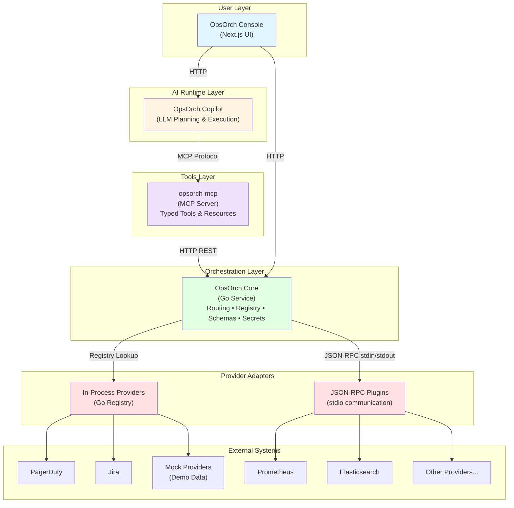

# OpsOrch

OpsOrch is an open, modular incident-operations platform that unifies incidents, logs, metrics, tickets, messaging, and services behind one orchestration layer. The project is split into focused repos so teams can mix and match pieces—from the Go core to MCP tools, Copilot runtime, console UI, and provider adapters—while keeping proprietary data in existing systems. Learn more at [opsorch.com](https://www.opsorch.com/).

## Why OpsOrch
- **Single API surface** for operational data across vendors without replicating records.
- **Adapter model** keeps provider logic decoupled, supporting in-process and plugin execution paths.
- **AI-native workflows**: the MCP server exposes typed tools and the Copilot runtime plans/tool-calls answers with citations.
- **Operator console**: a Next.js UI to browse incidents/logs/metrics/tickets/services and collaborate with Copilot outputs.
- **Security-first**: secrets stay encrypted, and Core remains stateless aside from integration metadata and optional audit logs.

## Repository Map
| Repo | Description |
| --- | --- |
| [`opsorch-core`](https://github.com/OpsOrch/opsorch-core) | Go orchestration service exposing REST APIs, schema boundaries, capability registry, and plugin loader. Holds no operational data.
| [`opsorch-mock-adapters`](https://github.com/OpsOrch/opsorch-mock-adapters) | Go adapters + plugins that return seeded data for every capability. Perfect for demos and local dev.
| [`opsorch-adapter`](https://github.com/OpsOrch/opsorch-adapter) | Starter template for building real provider adapters/plugins.
| [`opsorch-pagerduty-adapter`](https://github.com/OpsOrch/opsorch-pagerduty-adapter) | Reference adapter for PagerDuty incident workflows.
| [`opsorch-mcp`](https://github.com/OpsOrch/opsorch-mcp) | TypeScript MCP server that wraps Core HTTP APIs as typed tools/resources for agent runtimes.
| _`opsorch-copilot` (private)_ | Planning/runtime loop that calls MCP tools with LLMs (mock or real OpenAI-compatible backends).
| _`opsorch-console` (private)_ | Next.js operator interface that surfaces Core data and Copilot suggestions.
| [`opsorch-adapter-*`](https://github.com/orgs/OpsOrch/repositories) | External provider implementations that follow the same registry contract.

## Architecture



### Key Components

- **Console**: Operator-focused UI for browsing incidents, logs, metrics, services, tickets, and AI chat
- **Copilot**: AI runtime that uses LLMs to plan and execute MCP tool calls for operational queries
- **MCP Server**: Exposes Core APIs as typed MCP tools/resources for agent runtimes
- **Core**: Stateless Go service providing unified APIs, routing, schema boundaries, and secret management
- **Adapters**: Provider-specific implementations loaded in-process (via registry) or out-of-process (via JSON-RPC plugins)

### Design Principles

- **Core contracts** live under `opsorch-core/schema` and `opsorch-core/api`
- **Registry selection** is driven by env vars: `OPSORCH_<CAP>_PROVIDER` or `OPSORCH_<CAP>_PLUGIN` with `OPSORCH_<CAP>_CONFIG` JSON
- **Plugin RPC** uses JSON over stdin/stdout, keeping traffic on-box. `opsorch-mock-adapters` ship ready-made binaries under `bin/`
- **Secrets** are encrypted at rest and only decrypted when invoking providers; never logged or returned
- **No data replication**: Core holds only encrypted integration configs and optional audit logs; operational data stays in source systems

For deeper context, see `OPSORCH_MASTER.md` (in repo root) and `opsorch-architecture.drawio`.

## Run the Stack Locally
1. **Core with mock providers**
   ```bash
   cd opsorch-core
   OPSORCH_INCIDENT_PLUGIN=./plugins/incidentmock \
   OPSORCH_LOG_PLUGIN=./plugins/logmock \
   OPSORCH_SECRET_PLUGIN=./plugins/secretmock \
   go run ./cmd/opsorch
   ```
   (Optional) Build extra mock plugins via `make plugin` inside `opsorch-mock-adapters` and point env vars at `../opsorch-mock-adapters/bin/*`.

2. **MCP tools layer**
   ```bash
   cd ../opsorch-mcp
   npm install
   OPSORCH_CORE_URL=http://localhost:8080 OPSORCH_CORE_TOKEN=demo npm run dev
   ```

3. **Copilot runtime**
   > Copilot runs from the private `opsorch-copilot` repo; the same env vars apply once you have access.

4. **Console UI**
   > Console lives in the private `opsorch-console` repo; follow the same steps after cloning.

Health checks:
```bash
curl http://localhost:8080/health
curl -s http://localhost:7070/mcp \
  -H 'Content-Type: application/json' -H 'Accept: application/json, text/event-stream' \
  -d '{"jsonrpc":"2.0","id":1,"method":"tools/list"}'
```

## Build New Adapters
1. Copy [`opsorch-adapter`](https://github.com/OpsOrch/opsorch-adapter) as `opsroch-<provider>-adapter` (naming convention: `opsroch-*-adapter`).
2. Implement the capability interfaces you need (incident, log, metric, ticket, messaging, service, secret).
3. Export `New(config map[string]any)` and register: `incident.RegisterProvider("<name>", New)`.
4. Normalize provider payloads to current schemas; stash vendor-specific extras under `metadata`.
5. Add unit tests plus optional plugin entrypoints (`cmd/<cap>plugin`).
6. Publish binaries or import the module into your custom core build.

## Safety & Operations
- Always pass `service`/`team`/`environment` scope fields to narrow expensive queries.
- Gate high-risk mutations (paging, ticket creation, severity bumps) behind approvals in Copilot or Console.
- Secrets are decrypted only when invoking providers; never log or return them.
- Use audit logs (`opsorch-core/api/audit_log*.go`) to track mutations if required.

## Contributing & Support
- Issues/PRs welcome across repos; follow `opsorch-core/CONTRIBUTING.md` for coding standards.
- Discuss architectures via `OPSORCH_MASTER.md` or the draw.io diagram.
- Need another adapter? File an issue in this meta repo or the relevant service repo.
